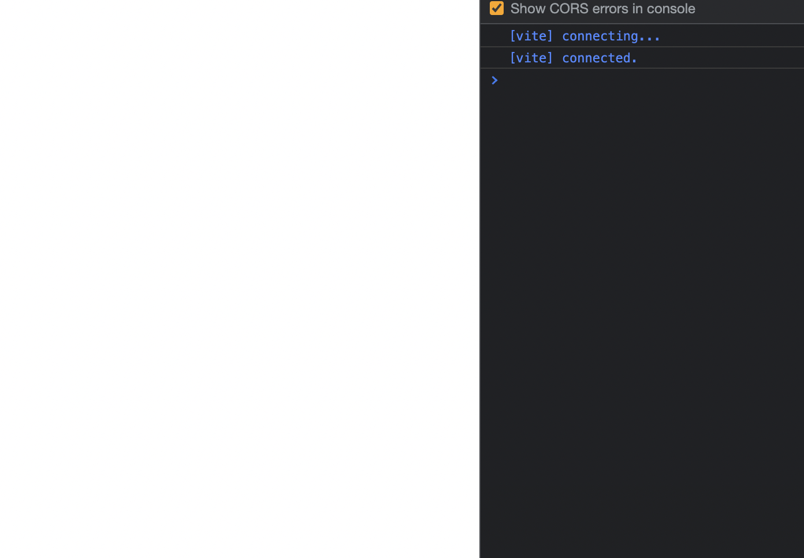
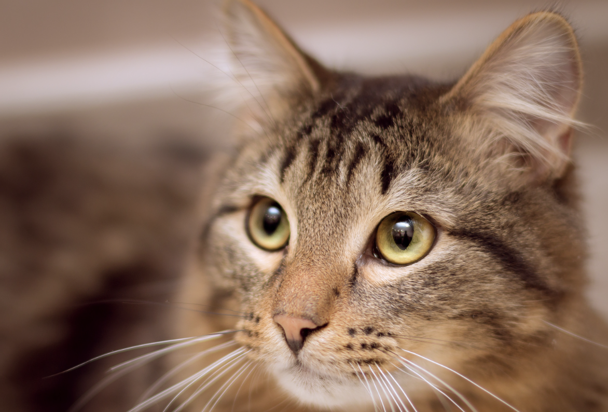
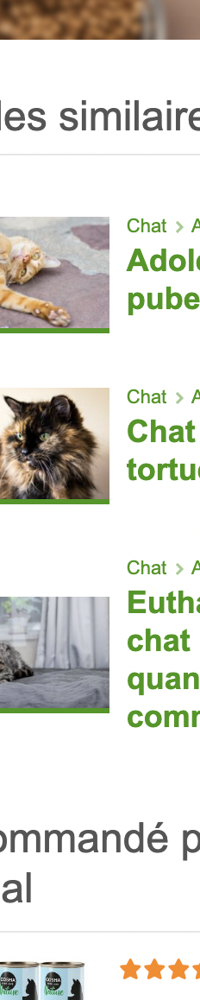

# Birbone 

It probably isn't styled much, but Markdown does support:
- **bold** and _italics._
- lists
- [links](https://astro.build)
- and more!

Ceux qui passent beaucoup de temps avec leur chat bien-aimé finissent toujours par ressentir le besoin d'apprendre son langage. Dans le langage des chats, on peut distinguer le langage verbal du langage non verbal, c'est-à-dire du langage corporel. Ce langage corporel se compose principalement des différentes postures de la queue du chat. Par exemple, on a parfois l'impression que le chat souhaite exprimer par toutes les déclarations verbales et non verbales possibles qu'il aimerait être nourri. Mais blagues à part, voici quelques caractéristiques du langage des chats.

Ceux qui passent beaucoup de temps avec leur chat bien-aimé finissent toujours par ressentir le besoin d'apprendre son langage. Dans le langage des chats, on peut distinguer le langage verbal du langage non verbal, c'est-à-dire du langage corporel. Ce langage corporel se compose principalement des différentes postures de la queue du chat. Par exemple, on a parfois l'impression que le chat souhaite exprimer par toutes les déclarations verbales et non verbales possibles qu'il aimerait être nourri. Mais blagues à part, voici quelques caractéristiques du langage des chats.

Ceux qui passent beaucoup de temps avec leur chat bien-aimé finissent toujours par ressentir le besoin d'apprendre son langage. Dans le langage des chats, on peut distinguer le langage verbal du langage non verbal, c'est-à-dire du langage corporel. Ce langage corporel se compose principalement des différentes postures de la queue du chat. Par exemple, on a parfois l'impression que le chat souhaite exprimer par toutes les déclarations verbales et non verbales possibles qu'il aimerait être nourri. Mais blagues à part, voici quelques caractéristiques du langage des chats.